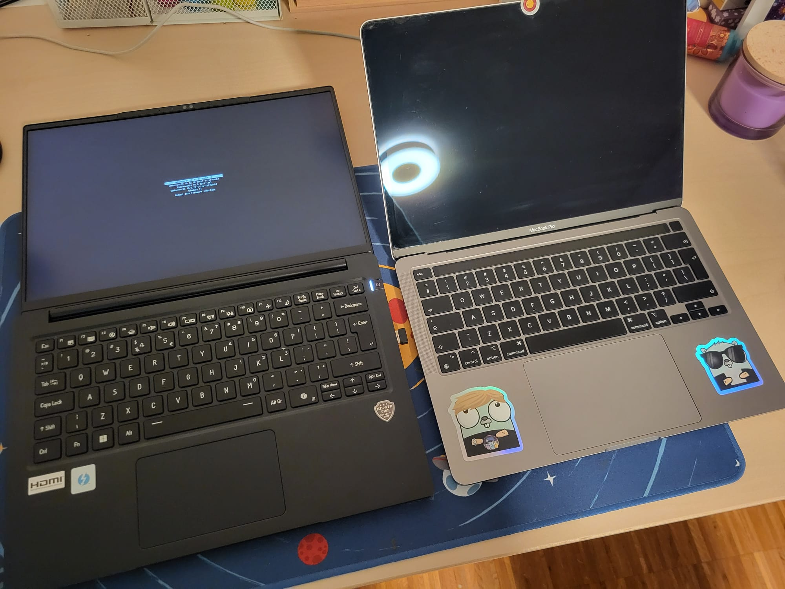

## What is the Fusion Series 14?

It is a [14 inch laptop sold by PC Specialist](https://www.pcspecialist.co.uk/notebooks/FusionVI-14/), in a [Clevo](https://www.clevo.com.tw/) chassis, with the Copilot/AI Laptop branding.

### Who is Clevo

[Clevo](https://www.clevo.com.tw/) is a Taiwanese company that specializes in the design and manufacturing of laptops. Founded in 1983, they are one of Taiwan's earliest notebook computer pioneers.

### What Clevo model is the Fusion Series 14?

[L24xLUx Series](https://www.clevo.com.tw/product/product_content/4/100)

### What configuration is my Fusion Series 14?

```specs
Chassis & Display
Fusion Series: 14" Matte FHD+ 72% NTSC LED (1920x1200)

Processor (CPU)
Intel® Core™ Ultra 7 8-Core Processor 258V (Up to 4.8 GHz) 12M Cache

Memory (RAM)
32GB LPDDR5X 8533MT/s 2ch MOP

Graphics Card
Integrated Intel® Arc™ Graphics

1st M.2 SSD Drive
2TB SAMSUNG 990 PRO M.2, PCIe 4.0 NVMe (up to 7450MB/R, 6900MB/W)

AC Adaptor
1 x 65W USB-C PD Adaptor

Power Cable
1 x 1.5 Metre Cloverleaf European Power Cable

Battery
Fusion Battery 73WH

Sound Card
2 Channel High Definition Audio + MIC/Headphone Jack

Bluetooth & Wireless
GIGABIT LAN & WIRELESS INTEL® Wi-Fi 6E AX211 + BT 5.3

USB/Thunderbolt Options
1 x THUNDERBOLT 4 + 1 x USB 3.2 (TYPE C) + 2 x USB-A 3.2

Keyboard Language
14" FUSION SERIES SINGLE COLOUR BACKLIT USA KEYBOARD
```

### Dimensions

##### Beer for scale


##### MacBook Pro 13" for scale




### Build Quality

Since I'm comparing it to my work MacBook Pro 13", I'll use that as a reference. Naturally, the Mac feels more premium, but the Fusion is lighter (under 1 kilogram) and has a matte screen. The chassis is plastic but feels solid, meeting the MIL-STD 810H standard. The keyboard is comfortable to use, though the key print feels cheap and uses an unusual font. I'm not sure if this is a Clevo design choice or something from PC Specialist. When ordering the laptop, you can select the keyboard layout, so it's possible that PC Specialist prints the font locally.


The article title makes it clear that the screen is FHD+ with a resolution of 1920x1200 and a 60Hz refresh rate. If you're looking for a higher refresh rate, the Fusion 16 offers a 144Hz QHD+ panel with 100% DCI-P3 coverage. Overall, I find the screen adequate for coding and occasional gaming.  

I opted for the 14-inch model instead of the 16-inch because I wanted a more portable device with better battery life. Since both versions come with the same 73Wh battery, I chose the more energy-efficient screen. Speaking of battery life, on Linux, I managed around 11-12 hours of usage (browsing, coding, and watching YouTube), with 18% battery remaining.  

I dual-boot EndeavourOS and Windows 11, and after about two hours of playing *The Sims 4* with my daughter today, the battery dropped to around 60%. Based on that, I’d estimate that gaming on battery lasts about 4-5 hours.

A downside in terms of build quality is the trackpad, which could be better. It feels somewhat cheap during use, but it gets the job done. However, since I primarily use a mouse, it's not a dealbreaker for me.  

On the positive side, despite the keyboard's unusual font/print, it is comfortable to type on and offers a good travel distance and overall feeel.

### Ports

- 1x USB-C (Thunderbolt 4)
- 1x USB-C 
- 2x USB 3.2
- 1x HDMI
- 1x 3.5mm headphone jack
- 1x SD card reader
  
### Wireless

An option between INTEL® Wi-Fi 6E AX211 and INTEL® KILLER™ Wi-Fi 6E AX1675 i/s . I chose the first as I am not a fan of the KILLER series. As I minus, both are dual-band Wi-Fi 6E and not Wi-Fi 7.

### Overall

I've been using the laptop for three days now. It came with Windows 11 pre-installed, even though I didn’t select an OS when configuring it. Since they assemble the Clevo-based chassis according to the customer's specifications, I was informed that they would install an unactivated version of Windows 11 for testing purposes. I simply resized the partition and installed EndeavourOS ([more details on this in my previous post](https://blog.alextldr.com/posts/lunix/)).  

On the first day, I primarily used Linux for more serious, production-related tasks like coding and setting up this blog. However, over the past two days, I’ve spent time on Windows playing *The Sims 4* and *Planet Zoo* with my daughter. I also tested my favorite game, *Football Manager 2024*, and it runs flawlessly. The laptop remains quiet and cool while gaming, with the fans only spinning up occasionally.  

Since the processor is 64-bit, it doesn’t have any compatibility issues like Qualcomm ARM-based laptops.

### Value for money

My configuration, including an extended warranty and a one-year dead pixel guarantee, came to a total of €1360, including delivery and taxes. Is that cheap? I’m not sure. What I do know is that I didn’t want a Mac for my personal laptop (the one I used for comparison is a work laptop that I don’t use for personal tasks), and a similarly configured Lenovo would have been significantly more expensive.  

Brands like Dell and Asus were not an option for me since I live in Germany, and they don’t offer laptops with a US keyboard—I specifically wanted to avoid a QWERTZ layout. Other choices included Tuxedo, but they didn’t have any Lunar Lake offerings at the time, or more expensive Linux-focused laptop manufacturers. In fact, I couldn’t find any Linux laptop brands offering Lunar Lake chips, likely because Linux support for this architecture is still in its early stages.  

Normally, I prefer AMD due to its better Linux compatibility, but I chose Lunar Lake primarily for its performance-to-power consumption ratio. Another key factor was my past experience—this is my third Clevo-based laptop (previously from Tuxedo), and my experience with the last two was positive.

### TL;DR

I want to clarify that this isn’t the most powerful option on the market. It’s not faster than the M4 chips or other Intel, AMD, or Qualcomm processors. YouTube is filled with comparisons of these chips, so I won’t repeat them here.

That said, this configuration—with its 32GB of fast 8533MT/s RAM—is more than capable of handling any development or office workload, with the added bonus of being able to run many modern games. While this isn’t a gaming machine, it can still run most modern titles at lower settings. I didn’t buy it for gaming, but the fact that it runs Football Manager flawlessly is a nice perk for when I’m on the go.

Like any hardware, it has its pros and cons. The keyboard isn’t particularly flashy, but it’s backlit, making it usable in the dark, and it’s comfortable to type on. The trackpad isn’t the best, but it gets the job done. Then again, don’t most people use a mouse anyway?

**One aspect I haven’t mentioned is the arrow key layout. The up/down arrow keys are the smaller, compressed format found on Mac keyboards. However, unlike MacBooks, this laptop also has the Page Up and Page Down keys cramped above the left and right arrows. While researching laptops, I came across a review where the author found this layout inconvenient, particularly for Vim users, as the PG Up/Down keys could get in the way. I haven’t experienced this issue myself, but I think it’s worth mentioning.**

