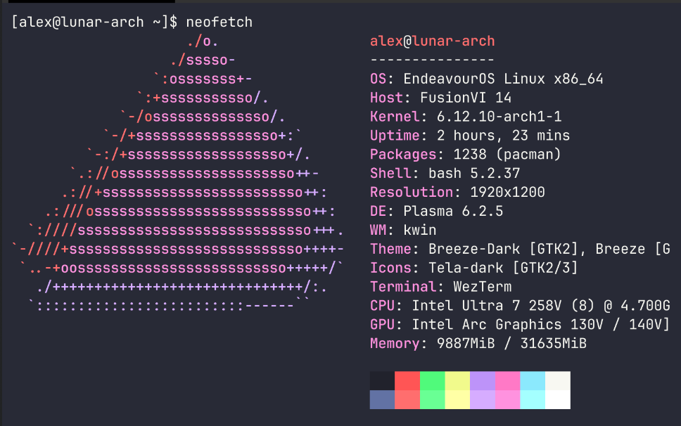

## Can I run Linux on my Lunar Lake Silicon laptop?

It seems that I can, since I am using it to write this blog post. Was it a seamless experience? Not really.
Could it have been easier? Probably. Why was it complicated? Because I can't say anymore, "BTW, *I'm* using Arch" 😉 .

The sad throoth is that I am using [EndeavourOS](https://endeavouros.com/) which is Arch for lazy people. In
my case, it turned out to be more work than I expected, as the official EndeavourOS iso comes with Linux kernel 
6.10.10 and according to [Phoronix, perf support was added in 6.11](https://www.phoronix.com/news/Linux-611-Perf-Arrow-Lunar-Lake). With an [Arch iso](https://archlinux.org/download/), at the time of writing, the kernel is 6.12.7.

Long story short, when I booted into the EndeavourOS live session, my WiFi didn’t work. After a lot of tinkering and reading, I decided to download the Arch ISO and install it instead. While flashing Arch onto a USB stick, I realized that the docking station I use for my work laptop has an RJ45 port. Naturally, I connected my new laptop to it, plugged in an Ethernet cable, and started the installation.  

During the setup, EndeavourOS updated everything, including the kernel. After the installation succeeded, all the hardware worked out of the box on the first boot. The only issue was with Bluetooth, but that was related to the WiFi chip (Intel’s Wi-Fi 6E AX211) rather than the processor.

### TL;DR

**Can Lunar Lake Silicon run Linux? Yes, right out of the box.** As of writing this, I’m using kernel 6.12.10, and everything works flawlessly.

Why did I choose Lunar Lake? I was looking for an affordable alternative to a MacBook with an M-series chip. I’m not comparing performance directly, but rather aiming for similar specs in everyday use and battery life. Since Qualcomm’s ARM architecture still has significant compatibility issues, I opted for the blue team. This is my first Intel-powered machine in a long time (sorry for the betrayal, AMD!), and my next blog post will be all about the laptop itself.

### Things tested so far with passing marks

- Battery life over 10 hours running Linux
- No compatibility issues with day to day apps (VS Code, Firefox, Slack, etc.)
- General stuff like keyboard shortcuts, touchpad, FN keys, keyboard backlight, etc.
- BIOS settings handling dual Windows 11/Linux installation

[Here’s the link to the laptop—the focus of my next blog post.](https://www.pcspecialist.co.uk/notebooks/FusionVI-14/)