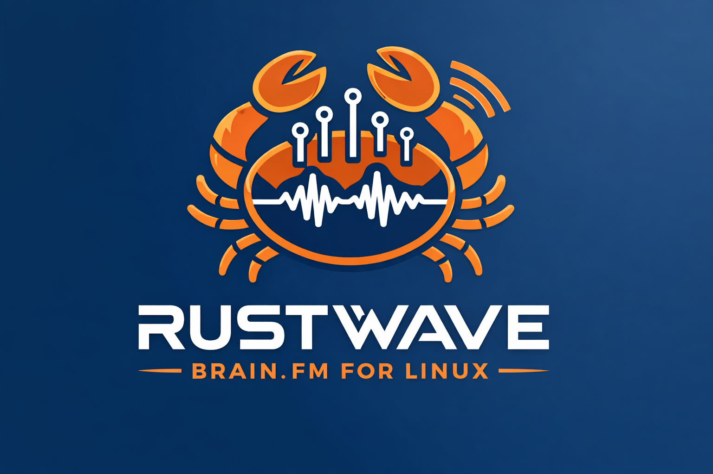
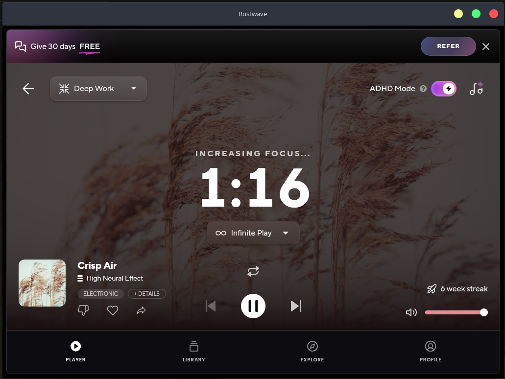
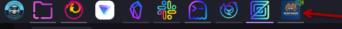

# My first Rust project
As you already know from the Rust-Zettels section of my blog, I am learning [Rust](https://rust-lang.org/) and I am trying to document my learning journey. I am using multiple sources for my learning, mostly inspired by [ImplFerris/LearnRust](https://github.com/ImplFerris/LearnRust?tab=readme-ov-file) Github repository. As most of the repository is exercises and reading material, I mostly listen to [Brain.fm](https://brain.fm) while learning. For me this is a great way to isolate myself from distractions and focus on learning.

My problem with [Brain.fm](https://brain.fm) is that it only has apps for iPhone, Android and macOS. For Linux, I could use my browser, navigate to the [Brain.fm website](https://brain.fm) and listen to the audio there. Since I already have too many browser tabs open, I couldn't stand having another tab between my groups and bookmarks in my browser. 

I thought this is the best opportunity to test my new [Rust](https://rust-lang.org/) skills. Since I didn't know exactly how to approach this, I first searched for APIs that I could use to interact with the Brain.fm website. I didn't find any official APIs, so I thought about the Electron way. Since I only know what Electron is and that it isn't the most resource friendly way to render a web page, I thought that maybe [Rust](https://rust-lang.org/) is not the right language for the job. I thought that a more familiar approach for me would be [Go](https://golang.org/) and the [Fyne](https://fyne.io/) framework.

I have to give credit here to Duck.ai as Duck Searching (😄 sounds weird but it is the equivalent of Google Search for DuckDuckGo), it gave me [Tauri 2](https://v2.tauri.app/) as an option to explore. This is my first interaction with [Tauri](https://v2.tauri.app/) but for me it ticks all the boxes: 
- it is a [Rust](https://rust-lang.org/) framework
- it allows me render the [Brain.fm website](https://brain.fm) in a desktop app

[Tauri](https://v2.tauri.app/) is capable of much more than just rendering a web page. It is a whole new way (for me at least 😂) of building cross-platform apps. Besides being built with Rust, [Tauri](https://v2.tauri.app/) is frontend independent and allows you to use any frontend technology you want. But enough about [Tauri](https://v2.tauri.app/). You can read more about it on their [website](https://v2.tauri.app/start/).

## A little bit about Rustwave

Rustwave is a desktop app built with [Rust](https://rust-lang.org/) and [Tauri](https://v2.tauri.app/) that renders the Brain.fm website.



By using [Tauri](https://v2.tauri.app/), which abstracts away many of the complexities of cross-platform app development, the actual Rust code that I wrote is in the `lib.rs` file and it is only a total of 7 lines of code.

```rust
#[cfg_attr(mobile, tauri::mobile_entry_point)]
pub fn run() {
    tauri::Builder::default()
        .plugin(tauri_plugin_opener::init())
        .run(tauri::generate_context!())
        .expect("error while running tauri application");
}
```

 `lib.rs` initializes a Tauri application, registers a single plugin, and points a WebView window at https://www.brain.fm/app. There is no custom frontend — the entire UI is Brain.fm's own web app.
 
 Besides `lib.rs`, the heart of [Tauri](https://v2.tauri.app/) is the `tauri.conf.json` configuration file.
 
 ```json
 {
   "$schema": "https://schema.tauri.app/config/2",
   "productName": "rustwave",
   "version": "0.1.0",
   "identifier": "work.dotsat.rustwave",
   "build": {
     "frontendDist": "../src"
   },
   "app": {
     "withGlobalTauri": true,
     "windows": [
       {
         "label": "brainfm",
         "title": "Rustwave",
         "width": 1024,
         "height": 768,
         "decorations": true,
         "url": "https://www.brain.fm/app"
       }
     ],
     "security": {
       "csp": null
     }
   },
   "bundle": {
     "active": true,
     "targets": ["deb", "rpm"],
     "icon": [
       "icons/32x32.png",
       "icons/128x128.png",
       "icons/128x128@2x.png",
       "icons/icon.icns",
       "icons/icon.ico"
     ],
     "linux": {
       "deb": {
         "depends": [
           "gstreamer1.0-plugins-base",
           "gstreamer1.0-plugins-good",
           "gstreamer1.0-plugins-bad",
           "libgstreamer1.0-0"
         ]
       },
       "rpm": {
         "depends": [
           "gstreamer1-plugins-base",
           "gstreamer1-plugins-good",
           "gstreamer1-plugins-bad-free",
           "gstreamer1"
         ]
       }
     }
   }
 }
``` 

This file keeps the application identity and several other configuration options.

```
"productName": "rustwave",
"version": "0.1.0",
"identifier": "work.dotsat.rustwave",
```
The URL `"url": "https://www.brain.fm/app"` points to the Brain.fm web app. The **Window Configuration** is declared with:
```json
"windows": [
  {
    "label": "brainfm",
    "title": "Rustwave",
    "width": 1024,
    "height": 768,
    "decorations": true,
    "url": "https://www.brain.fm/app"
  }
]
```
Besides these settings, there are options like `icon`, `menu`, `resizable`, and `fullscreen` that can be configured. For example, by configuring `icon`, you can set a custom icon for your app.




 ### What does [Tauri](https://v2.tauri.app/) abstract away?

[Tauri](https://v2.tauri.app/) wraps a native OS window around a WebView component. On Linux this is WebKitGTK, the same engine used by GNOME Web. The [Rust](https://rust-lang.org/) process manages the window lifecycle; the web engine renders the content. On Linux, WebKitGTK delegates audio and video playback to GStreamer. [Brain.fm](https://www.brain.fm/) streams audio, so GStreamer plugins (`gst-plugins-base`, `gst-plugins-good`, `gst-plugins-bad`, `gst-libav`) must be present on the system. The .deb and .rpm packages declare these as dependencies so they are installed automatically. In my case, using [EndeavourOS](https://endeavouros.com/), I had to install these plugins manually.

```bash
sudo pacman -S webkit2gtk-4.1 gst-plugins-base gst-plugins-good gst-plugins-bad gst-libav
```

I like that this approach also stores the session out of the box. I have logged into my [Brain.fm](https://www.brain.fm/) account and my session is preserved across restarts. WebKitGTK stores cookies and session data under `~/.local/share/work.dotsat.rustwave/`, the app's unique identifier. This means logging in once persists across all future launches, exactly like a native app.

**No Electron, no Node.js, no Chromium.** The binary is a single compiled [Rust](https://rust-lang.org/) executable. [Tauri](https://v2.tauri.app/) uses the system's already-installed WebKit instead of bundling a browser, which is why the final binary is small and the memory footprint is low compared to an Electron equivalent.

`cargo tauri build` produces `.deb` and `.rpm` bundles with declared GStreamer dependencies. For Arch Linux, a PKGBUILD in the pkg/ directory builds a `.pkg.tar.zst` installable with pacman, which also installs the `.desktop` file and icon so the app integrates properly with the desktop environment. More technical details are available in the project's [README file](https://github.com/dotsat-work/rustwave).

### Security

Since in the past there were security concerns with Tauri V1, now V2 uses a permissions system defined in `capabilities/default.json`. 
```json
{
  "$schema": "../gen/schemas/desktop-schema.json",
  "identifier": "default",
  "description": "Capability for the main window",
  "windows": ["main"],
  "permissions": [
    "core:default",
    "opener:default"
  ]
}
```

In this case, only the default capabilities are available plus opener, which allows opening external links. The web content cannot access the filesystem or any other system resource. Like any other project, keeping [Tauri](https://v2.tauri.app/) and its dependencies updated is crucial for mitigating risks.

## Ideas and contributions

The best way to learn new things is by building applications. If you have any ideas or contributions, feel free to open an issue or submit a pull request. I am also looking for help with Windows support. The [Brain.fm](https://www.brain.fm/) Windows listeners face the same challenge as Linux users, there is no official [Brain.fm](https://www.brain.fm/) Windows client.

---  
I am hosting my blog with 🐹[Hugo](https://gohugo.io/) but I recently found another interesting 🦀[Rust](https://rust-lang.org/) project called [Zola](https://www.getzola.org/). I will play with it and write about it in a future post outside of the Rust-Zettels series. For the experienced rustaceans out there, I know [Zola](https://www.getzola.org/) was released in 2017 but I discovered it recently and for me is new 😁.
