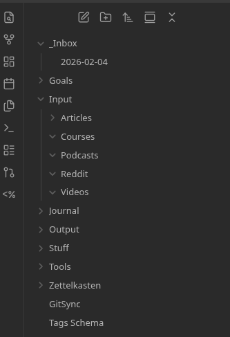

## What's the goal of this series?

This is my journey to learning Rust. A short intro about me, I am Alex, a self-taught Go
developer, with an interest in DevOps and Linux. I try staying engaged with the local community by hosting the local Go
meetup, [Stuttgart Gophers](https://stuttgart-gophers.de).

I still love Go, but I've recently become curious about Rust. I started playing with Rust in September or October
2025, but life happens, and in one way or another, I keep getting distracted with other projects.

I believe that by writing this blog series, I can keep track of my progress, share my opinions, and
Most importantly, stay motivated to learn Rust by maintaining consistency.

Besides the learning materials, which I will share along the evolution of the blog, doing exercises and
small projects (as this is the best way to learn), I want to use the Zettelkasten Methodology to organize,
take notes and keep track of my process.

Regarding my commitment to updating the blog, I will commit to weekly posts, except for holiday 
periods in which it is possible that I will skip a week.

## What is the Zettelkasten Methodology?

The [Zettelkasten Methodology](https://en.wikipedia.org/wiki/Zettelkasten) is a note-taking system popularized by the 
German philosopher and sociologist Niklas Luhmann. It is based on the idea of creating a personal database of notes, 
called Zettels, that are connected to each other through links. The Zettelkasten Methodology is a way to
organize your thoughts and ideas in a way that is flexible, scalable, and easy to use.

## [Obsidian](https://obsidian.md/)

I want to use [Obsidian](https://obsidian.md/) for my Zettels as it already uses Markdown under the hood (the same as this 
blog that is built with [Hugo](https://gohugo.io/)), has a great graph view, and has a free tier. It also has a great Git 
integration, which I use for backup purposes, as my Zettels evolve.

Searching the internet, there are many guids regarding how to setup Obsidian for a Zettelkasten, but I will
share the one that I found the most vanilla: [How to Use Obsidian as a Zettelkasten: The Ultimate Tutorial](https://mattgiaro.com/obsidian-zettelkasten/).

TL;DR: Don't focus on complex setups, as the whole idea is to be productive and not waste time with a lot of configs. I 
believe that everybody has its own way of working, and that with time, you'll have your own personalized Zettelkasten
workflow.

Below is my current Obsidian schema:

## Final words

As English is not my native language, please excuse my mistakes. The best way of learning is by writing, so I will 
write this series without AI generation. The whole scope of this series is for me to write about Rust, consolidate my learning, 
and share my thoughts on the blog.

For feedback, questions, or suggestions, you can reach me at [alex@alextldr.com](mailto:alex@alextldr.com).

