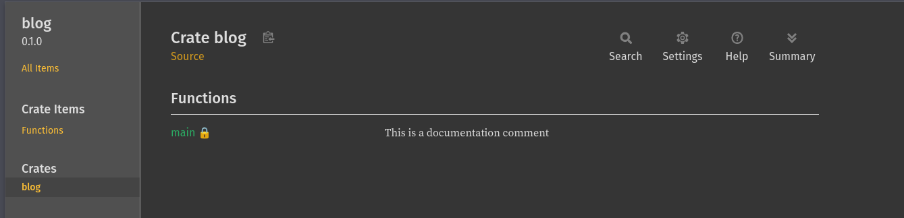

## Is Rust a good first language?

> Below is what copilot from my IDE suggested
>> No. Rust is not a good first language. It is a complex language with a steep learning curve. It has a lot of
features that are not necessary for beginners, and it has a lot of rules that are not intuitive. It is a great
language for systems programming, but it is not a great language for learning programming.

I think many people don't need Copilot to tell them that. This is the majority opinion in the programming communities.
Most people consider Rust a second or third language to learn. I would say that my 1st language is Go, but in my learning 
journey, I touched Python as well, even used it in my DevOps roles. Besides Python, I have touched a little C and
JavaScript. I have used C in learning projects to understand memory management and JS mostly to help with the 
frontend part of my projects.

From the languages mentioned above, I can say that I formed an opinion regarding type safety, and this was the main reason
I chose Go as my primary language. I simply didn't start with programming like a lot of people do, by learning Python
for its English-like syntax, because I missed the type safety. Go was the best choice for me at the time.

Now starting to learn Rust, being approximately 3-4 months in the process, I would disagree with everybody who thinks that Rust
is not a great 1st language. I believe it has all the ingredients to teach a new programmer about a lot of CS aspects.
For example, it has the classic primitives like i8, i16, i32, i64, u8, u16, u32, u64, f32, f64, char, bool, and also strings. 
Besides the classic primitives, it also has more “weird” types like i128 or u128, which not all the languages have.

Because Rust is focused on speed, it teaches you how to use types efficiently. For example, -13 in i8 is stored as 11110101, 
while in i16 it is stored as 1111111111110101, in i32 it is stored as 11111111111111111111111111110101, and in i64 it 
is stored as 111111111111111111111111111111111111111111111111111111111110101. This teaches you about memory efficiency.

Because of ownership, the programmer learns about memory management. If Go is garbage collected and the GC is handling 
most of the memory management, Rust is using lifetimes. After a variable is out of scope, it is dropped and it no longer exists.

With immutable variables by default, the programmer is forced to think about the data and how it is used. If a variable 
should be changed, it needs to be explicitly marked as mutable.

Type strictness teaches the programmer about types and how to use them efficiently. The compiler is most of the time smart
enough to infer (guess) the type of a variable, but the programmer has the freedom to be explicit about what types they 
want to use.

In the below example, the compiler will infer that x and y are f64, and z will also be f64.
```rust
fn main() {
    let x = 1.0;
    let y = 3.14;
 
    let z = x + y;
}
```

In the below example, because x is f32, the compiler will infer that y is also f32, and z will be f32 as well.

```rust
fn main() {
    let x: f32 = 1.0;
    let y = 3.14;
 
    let z = x + y;
}
```
Another strong argument is the compiler paired with [Clippy](https://doc.rust-lang.org/stable/clippy/index.html). The 
compiler "complains" everytime something is not right, and Clippy "complains" everytime something is not idiomatic. 
This teaches the beginner to write clean code from the start. Reading the below code and the compiler output, it is easy
to understand what is wrong and how to fix it.

```rust
fn main() {
    let x: f32 = 1.0;
    let y: f64 = 3.14;
 
    let z = x + y;
}
```
The code will return the following error:
```
cargo run
   Compiling ignore v0.1.0 (/home/alex/github.com/AlexTLDR/rust-sandbox/ignore/ignore)
error[E0308]: mismatched types
 --> src/main.rs:5:17
  |
5 |     let z = x + y;
  |                 ^ expected `f32`, found `f64`

error[E0277]: cannot add `f64` to `f32`
 --> src/main.rs:5:15
  |
5 |     let z = x + y;
  |               ^ no implementation for `f32 + f64`
  |
  = help: the trait `Add<f64>` is not implemented for `f32`
  = help: the following other types implement trait `Add<Rhs>`:
            `&f32` implements `Add<f32>`
            `&f32` implements `Add`
            `f32` implements `Add<&f32>`
            `f32` implements `Add`

Some errors have detailed explanations: E0277, E0308.
For more information about an error, try `rustc --explain E0277`.
error: could not compile `ignore` (bin "ignore") due to 2 previous errors
```
It is clear that the compiler is telling us that we are trying to add two different types, and it also gives us a hint
on how to fix it.

**These are just some reasons that I believe Rust is a great language for a beginner to learn. I would say that programming
in general is hard to learn and that you need to put in the time, but Rust gives you a structure that helps you to write
good code from the start.**

# Now let's do some Rust basics

## Variables

Variables in Rust are immutable by default. This means that once a variable is initialized, it cannot be changed. 
To make a variable mutable, the `mut` keyword needs to be used.

```rust
fn main() {
    let x = 5;
    println!("x is {x}");
    x = 6;
    println!("x is {x}");
}
```
The code above will return the following error:
```
error[E0384]: cannot assign twice to immutable variable `x`
 --> src/main.rs:4:5
  |
2 |     let x = 5;
  |         -
  |         |
  |         first assignment to `x`
  |         help: consider making this binding mutable: `mut x`
3 |     println!("x is {x}");
4 |     x = 6;
  |     ^^^^^^^^^^^^^^^^^^^ cannot assign twice to immutable variable
```

To fix the error, we need to add the `mut` keyword to the variable declaration.
```rust
fn main() {
    let mut x = 5;
    println!("x is {x}");
    x = 6;
    println!("x is {x}");
}
```
## Primitive types

Rust has the following primitive types:

### Integers

Integers are whole numbers. They can be signed or unsigned. Signed integers can be positive or negative, while unsigned
integers can only be positive. The size of the integer is specified by the number of bits it uses. The most common sizes
are 8, 16, 32, and 64.

| Length       | Signed | Unsigned |
|--------------|--------|----------|
| 8-bit        | i8     | u8       |
| 16-bit       | i16    | u16      |
| 32-bit       | i32    | u32      |
| 64-bit       | i64    | u64      |
| 128-bit      | i128   | u128     |
| Architecture | isize  | usize    |

The isize and usize types are architecture dependent. This means that the size of the integer will change depending on the
architecture of the computer. On a 32-bit computer, isize and usize will be 32-bit, while on a 64-bit computer, they will
be 64-bit.

### Floating point numbers

Floating point numbers are numbers with a decimal point. They are also signed or unsigned. The most common sizes are 32 and 64.

| Length | Signed   | Unsigned |
|--------|----------|----------|
| 32-bit | f32      |          |
| 64-bit | f64      |          |

### Characters
Characters are Unicode scalar values. They are 4 bytes long. They are written with single quotes.

```rust
fn main() {
    let c = 'a';
    println!("c is {c}");
}
```

### Booleans
Booleans are true or false. They are 1 byte long. They are written with the keywords true or false.

```rust
fn main() {
    let t = true;
    let f = false;
    println!("t is {t}, f is {f}");
}
```

### Strings
Strings are UTF-8 encoded text. They are written with double quotes.

```rust
fn main() {
    let s = "Hello, world!";
    println!("s is {s}");
}
```
*More about strings in the next post.*

## Declaring variables and code blocks
Variables can be declared with the `let` keyword. Code blocks are declared with the `{}` braces.

```rust
fn main() {
    let x = 5;
    {
        let y = 6;
        println!("x is {x}, y is {y}");
    }
    println!("x is {x}, y is {y}");
}
```
The code above will return the following error:
```
error[E0425]: cannot find value `y` in this scope
  --> src/main.rs:7:22
   |
7  |     println!("x is {x}, y is {y}");
   |                      ^ not found in this scope
```
The variable `y` is not available outside of the code block where it was declared.

## Mutability
Variables are immutable by default. This means that once a variable is initialized, it cannot be changed. 
To make a variable mutable, the `mut` keyword needs to be used.

```rust
fn main() {
    let mut x = 5;
    println!("x is {x}");
    x = 6;
    println!("x is {x}");
}
```
## Shadowing
Shadowing occurs when we declare a new variable with the same name as a previous one. In a nested scope, the old variable
is preserved and becomes accessible again once the inner scope ends. However, in the same scope, the new variable effectively 
replaces the old one for the remainder of that block.

```rust
fn main() {
    let x = 5;         // Variable A
    let x = x + 1;     // Variable B shadows Variable A (Same scope)
    // Variable A is now effectively inaccessible and will be dropped.

    {
        let x = x * 2; // Variable C shadows Variable B (New scope)
        println!("x in the inner scope is {x}"); // Uses Variable C
    } 

    // Variable C goes out of scope.
    println!("x in the outer scope is {x}"); // Variable B becomes accessible again!
}
```
**Why use Shadowing instead of Mutability?**

At first glance, shadowing is a more complicated way to do what `mut` does. But there are some advantages for using shadowing:

1. Changing types - We can use the same name for a variable and transform data and keep the name relevant:
```rust
fn main() {
    let x = 5;
    let x = x.to_string();
}
```
2. Preserving immutability - When using `let mut`, the variable is muttable for its entire life. This can lead to accidental
changes. With shadowing, a new immutable variable is created each time. This way we get the benefit of transformation, 
but once the final `let` is declared, the value is "locked" and cannot be changed accidentally.
3. Memory and "Moves" - Under the hood, when you shadow a variable that owns heap data (like a String), the original variable is dropped, 
and the new variable takes ownership of the data. If you shadow a variable in a nested block, the memory of the outer 
variable remains on the stack, "hidden" until the block ends.
4. TL;DR :
    - use mut when you have a single object that needs to change its state over time (like a counter or a list you are 
appending to)
    - use shadowing when you are processing data (converting, trimming or scaling) and want to reuse a descriptive name
without making it accidentally changeable/mutable.

## Comments
At the end of the post, I want to mention about comments. As in a lot of programming languages, Rust uses `//` for single 
line comments and `/* */` for multi-line comments. Only notable thing, `///` is used for documentation purposes.
```rust
/// This is a documentation comment
fn main() {
    // This is a single line comment
    /*
    This is a multi-line comment
    */
}
```
Running `cargo doc --open` will generate documentation from the comments:



---
The next post will dive deep into how Rust manages data under the hood. We will cover:
- **Memory Fundamentals**: Understanding the `stack`, the `heap`, pointers, and references.
- **Strings**: Exploring the most common way to work with text.
- **Globals**: Using `const` and `static` for variables that last forever.
- **Deep Dives**:
    - More on **shadowing**
    - **Types that Copy vs. Types that Move**: How Rust handles data duplication and ownership transfers.
    - tips for **printing** and **formating** output


